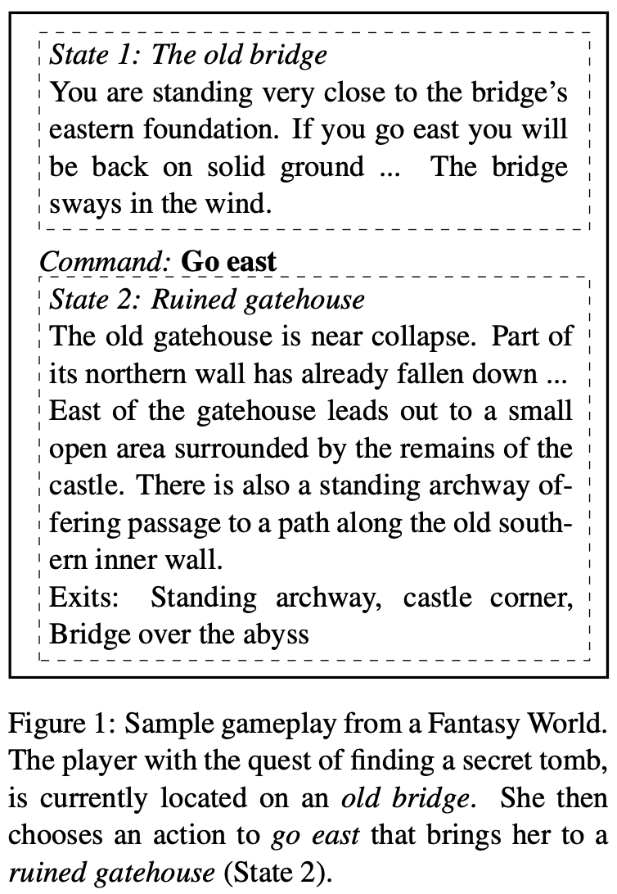
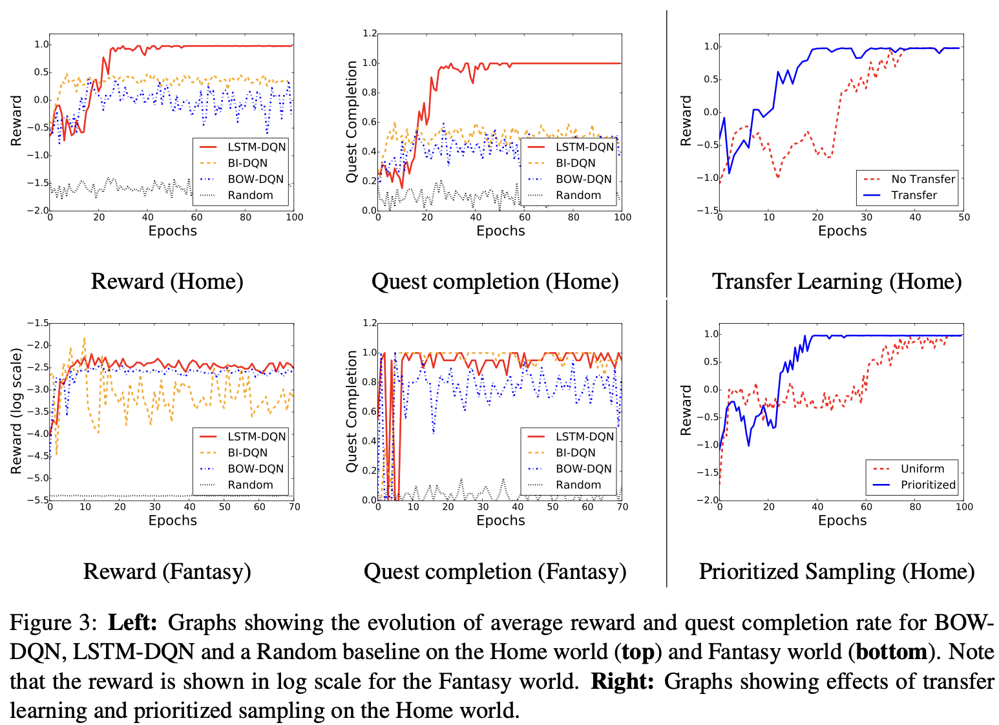

# CS294
Berkeley COMPSCI 294 LLM Agents, Guest: [Shunyu Yao]()
What is llm agents? agent is an intelligent system that interacts with some environment, including physical environments of robot, auto cars, digital environments of dqn4Atari/Siri/AlphaGo, humans as environments of chatbot; define agent by defining intelligent and environment, it changes overtime; text agent that uses action and observation, such as ELIZA,LSTM-DQN, llm agent that uses llm to act, such as SayCan,Lang Planner, reasoning agent that uses llm to reason to act, such as ReAct,AutoGPT; ELIZA(1966) :text agent via rule description, domain specific, requires manual design, cannot work beyond simple domains, LSTM-DQN(2015) :text agent via rl, 
